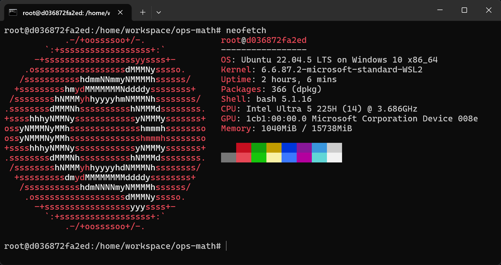

## 团队信息

- 团队名称：伊格小队
- 所属单位：青岛恒星科技学院
- 团队成员：
  - 张德鑫，队长
- 联系人：张德鑫
- 联系邮箱：lggyx9527@gmail.com

## 环境要求

- Docker镜像：`yeren666/cann-ops-test:v1.0`



## 文件说明

- `code/`：测试代码源文件，按算子分子目录组织
  - `code/Add/test_aclnn_add.cpp`：Add 算子测试代码
  - `code/Mul/test_aclnn_mul.cpp`：Mul 算子测试代码
  - `code/Pow/test_aclnn_pow.cpp`：Pow 算子测试代码
- `report/`：测试报告
  - `report/Add.md`：Add 算子测试报告文档
  - `report/Mul.md`：Mul 算子测试报告文档
  - `report/Pow.md`：Pow 算子测试报告文档

## 编译与运行

以 Add 算子为例（Mul 和 Pow 只需将命令中的 `add` 替换为 `mul` 或 `pow`）：

1. 进入对应算子目录：`cd code/Add`

2. 复制测试文件到`ops-math`项目对应的位置

   ```bash
   cp test_aclnn_add.cpp /home/workspace/ops-math/math/add/examples/test_aclnn_add.cpp
   ```

3. 编译

   ```bash
   # 切换到ops-math项目目录
   cd /home/workspace/ops-math
   # 编译算子
   bash build.sh --pkg --soc=ascend950 --ops=add --vendor_name=custom --cov
   ```

4. 安装算子包

   ```bash
   ./build_out/cann-ops-math-custom_linux-x86_64.run
   ```

5. 运行

   ```bash
   bash build.sh --run_example mul eager cust \
       --vendor_name=custom --simulator --soc=ascend950 --cov
   ```

   运行成功后会在 `build/` 目录下生成覆盖率数据文件（`.gcda`）。

6. 查看覆盖率

   ```bash
   find build -name "*.gcda" | grep add
   gcov -b <gcda文件路径>
   ```
