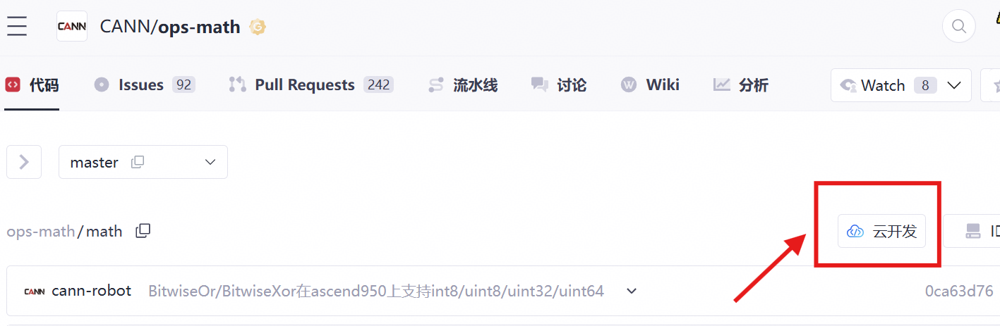
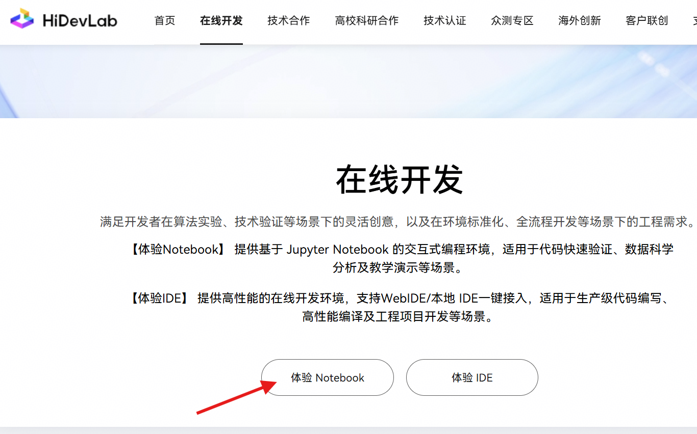

# ForeachSubListV2算子开发任务书

## 基础信息

- **技术标签**：算子开发
- **适配硬件**：Atlas A2 训练系列产品/Atlas A3 系列产品
- **开源仓地址**：[https://gitcode.com/cann/ops-nn](https://gitcode.com/cann/ops-nn)
- **CANN 版本**：算子开源仓指定版本
- **开发语言**：Ascend C

## 任务概述

当前aclnnForeachSubListV2算子不支持DT_INT16/DT_INT8/DT_UINT8数据类型，需要在原来的代码上进行再开发，使其支持DT_INT16/DT_INT8/DT_UINT8数据类型。要求完成算子设计，算子开发及算子测试任务。验收后需将该算子提交到算子开源仓。

## 核心开发要求及验收标准

### 功能实现要求

1. 请通过修改 <https://gitcode.com/cann/ops-nn/tree/master/foreach/foreach_sub_list> 目录下的文件，使其支持DT_INT16/DT_INT8/DT_UINT8数据。注意还应修改相应文档，补充DT_INT16/DT_INT8/DT_UINT8的支持情况。
2. 必须实现算子泛化功能，满足各类合法输入场景的计算需求，验收阶段将采用泛化数据进行验收。

### 测试标准

测试用例覆盖**常规场景、边界场景**等所有功能场景；自验证报告完整、可复现，所有测试用例执行通过。

### 性能要求

> 无

### 精度要求

算子计算精度需满足 [AscendOpTest](https://gitcode.com/HIT1920/AscendOpTest) 工具默认阈值

### 文档规范要求

1. 算子设计文档需根据[参考模板](https://gitcode.com/cann/cann-competitions/blob/master/04_tasks/01_community-task-2026/resources/design_template.md)填写，内容完整、格式规范，且必须通过评审；
2. 自验证报告需要覆盖所有功能场景，参考[xxx算子自验证报告](https://docs.qq.com/sheet/DUmVWWndaUE12WGFB?tab=BB08J2)（不需要模板中TBE样例结果），含测试用例执行日志/截图、整体测试通过截图、性能数据截图，可清晰指导算子使用与测试；
3. README 文档内容完整、规范。

## 验收规则与流程

### 提交验收申请

联系昇腾小助手，提交以下**三类交付件**进行验收：

1. 昇腾开源算子仓 fork 的个人代码仓链接（需包含：算子工程代码、算子 README 文档、多组 aclnn 调用测试代码）；
2. 算子自验证报告；
3. 华为评审通过的算子设计文档（按模板填写），合入 [cann-competitions 仓库](https://gitcode.com/cann/cann-competitions/tree/master/04_tasks/01_community-task-2026/tasklist) 详细说明见 [readme](https://gitcode.com/cann/cann-competitions/blob/master/04_tasks/01_community-task-2026/README.md)。

### 验收结果反馈

验收以提交验收申请时的代码为准，72小时内反馈验收结果，如代码更新请重新提交验收申请，验收时间同步刷新。

### PR 申请合入

验收通过后，在昇腾算子开源仓提交 PR 申请，申请将开发完成的算子合入 <https://gitcode.com/cann/ops-nn/tree/master/foreach/foreach_sub_list>。

需要注意的是，由于合入的PR会纳入正式版本，因此PR合入后还需要等待版本测试通过后方可验收通过。

## 参考资料

1. 文档类：[Ascend C算子开发文档](https://www.hiascend.com/document/detail/zh/CANNCommunityEdition/850/opdevg/Ascendcopdevg/atlas_ascendc_map_10_0002.html)、[算子开发接口文档](https://www.hiascend.com/document/detail/zh/canncommercial/850/API/ascendcopapi/atlasascendc_api_07_0003.html)
2. 课程类：[Ascend C在线课程](https://www.hiascend.com/developer/courses/detail/1691696509765107713)
3. 代码样例：[https://gitcode.com/cann/ops-nn/tree/master/foreach](https://gitcode.com/cann/ops-nn/tree/master/foreach)

## 环境获取

1. 开源仓提供100小时免费时长，请不使用时及时关闭，用时耗尽前请务必保存相关资料，建议及时提交备份。

   

2. 使用 hidevlab notebook 算力（[https://hidevlab.huawei.com/online-develop-intro?from=hiascend](https://hidevlab.huawei.com/online-develop-intro?from=hiascend)）

     
   

3. 如需额外环境资源，请联系昇腾小助手。

## 特别注意事项

1. 开发过程需严格遵循 Ascend C 编程规范及算子开发相关要求；
2. 所有交付件需提前完成自验证，确认符合验收标准后再提交验收申请；
3. 开发前请务必阅读[【社区任务】流程及注意事项](https://gitcode.com/org/cann/discussions/39)，会例行更新。