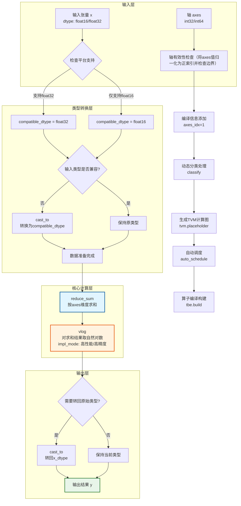
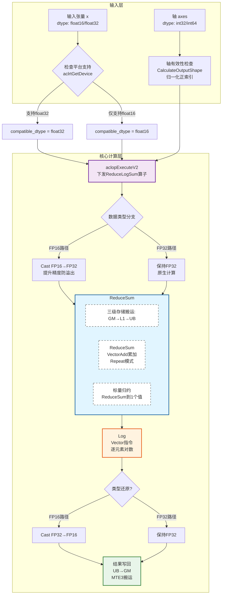

# 1. 需求背景（Required）

## 1.1 需求来源

- **来源活动**：2026昇腾CANN训练营第三期（算子开发方向）。
- **任务编号**：TaskID=7。
- **任务目标**：响应昇腾算子众智计划，丰富Ascend C算子库生态。本任务要求基于Ascend C编程语言重构ReduceLogSum算子，以替换原有的TBE（DSL/Python）实现，旨在提升算子在Atlas A2系列处理器上的执行性能与维护性。

## 1.2 背景介绍

当前的算子通常基于TBE DSL（Tensor Boost Engine Domain Specific Language）开发。为了进一步挖掘硬件算力，提升算子在复杂场景下的调度效率，本项目计划在昇腾NPU（Atlas A2训练系列产品）上，使用Ascend C（C++ Native Programming）编程范式重新实现该算子。

### 1.2.1 ReduceLogSum算子实现优化
（TBE）实现路径和相关API路径

- TBE算子参考实现路径：
/usr/local/Ascend/ascend-toolkit/latest/opp/built-in/op_impl/ai_core/tbe/impl/ops_legacy/dynamic/reduce_log_sum.py

- 算子原型定义路径：
/usr/local/Ascend/cann/opp/built-in/op_proto/inc/reduce_ops.h

- 算子信息库路径：
/usr/local/Ascend/ascend-toolkit/latest/opp/built-in/op_impl/ai_core/tbe/config/ascend910b/aic-ascend910b-ops-info-legacy.json

### 1.2.2 ReduceLogSum算子现状分析

#### 1.2.2.1 TBE算子支持的数据类型和数据格式
| **参数名** | **名称** | **类别** | **数据类型 (dtype)**       | **数据格式 (format)** | **Shape** | **描述**         |
| ---------- | -------- | -------- | -------------------------- | --------------------- | --------- | ---------------- |
| **input0**      | x   | 输入     | float16,float,float16,float | ND,ND,ND,ND          | All       | 规约操作的源张量 |
| **input1**      | axes   | 输入      | int64,int64,int32,int32 | ND,ND,ND,ND          | All       | 指定规约的维度 |
| **attr**      | keep_dims   | 属性     | bool | -             | -       | 是否保留归约维度 |
| **output0**      | y  | 输出     | float16,float,float16,float | ND,ND,ND,ND          | 同输入    | 规约后的张量结果 |
#### 1.2.2.2 TBE算子实现描述
$$ \text{ReduceLogSum}(x, \text{axes}) = \ln\left(\sum_{\text{axes}} x\right) $$
详细展开形式：
$$ y_{i_1, i_2, \dots, i_{k-1}, i_{k+1}, \dots, i_n} = \ln\left(\sum_{j=0}^{N_k-1} x_{i_1, i_2, \dots, j, \dots, i_n}\right) $$
- 输入张量x形状为：$(N_1, N_2, \dots, N_n)$
- axes为归约轴集合，指定在哪些维度上求和。
- y为输出张量：当keep_dims=True 时，被归约的维度保留为1；当keep_dims=False时，被归约的维度被移除。

TBE先进行输入张量数据类型的检查和轴的有效性检查，支持float32和float16类型的数据；倘若输入不匹配就进行类型转换，按照兼容的浮点数据类型进行规约计算并对求和结果取自然对数；完成计算后根据是否进行转换将结果还原回原始类型作为输出张量。整个流程通过classify分发与多schedule编译，支持动态shape：
- 输入层：负责检查输入参数的合法性，包括数据类型、形状匹配以及轴的合法性检验
- 类型转换层：作数据类型兼容性的转换逻辑
- 核心计算层：按维度进行求和以及取对数
- 输出层：按照是否兼容进行类型还原逻辑
- 调度与构建模块：负责 TVM 计算图的调度和算子构建
#### 1.2.2.3 TBE算子实现流程图

# 2. 需求分析

## 2.1 外部组件依赖

本设计不涉及第三方库（如OpenCV, Protobuf等）的依赖，完全基于CANN提供的Ascend C基础库（`kernel_operator.h` 等）进行开发。

## 2.2 内部适配模块

- **Aclnn接口适配**：需提供适配层的代码，支持上层应用通过接口直接调用。
- **图模式适配**：支持在Graph模式下通过算子原型推导并执行。

## 2.3 需求模块设计

### 2.3.1 AscendC算子原型
 | **名称**  |  **类别**   | **数据类型（dtype）**           | **format** | **Shape**                 | **描述**                                                                 |
 |:---------:|:---------:|:----------------------:|:------:|:------------------------:|:--------------------------------------------------------------------:|
 | x          | 必选输入   | float16/float32 | ND     | 任意形状（支持动态形状/动态秩） | 输入张量，支持动态形状、动态秩，为归约操作的数据源                   |
 | axes       | 必选输入   | int32/int64     | ND     | 一维向量（支持动态形状）| 指定归约的维度，元素为归约轴索引（支持负数轴，负数轴表示从后往前数的维度） |
 | y          | 必选输出   | float16/float32 | ND     | 归约后形状                | 输出张量，形状由输入x的形状、axes指定的归约维度、keep_dims属性共同决定 |
 | keep_dims  | 可选属性   | bool            | ---    | ---                      | 是否保留归约维度，默认值为false；若为true，归约维度保留为1，否则剔除  |
### 2.3.2 AscendC算子相关约束
暂无
# 3. 需求详细设计

## 3.1 使能方式
| **上层框架**     | **涉及勾选** | **说明**                          |
| ---------------- | ------------ | --------------------------------- |
| TF训练/推理      |              |                                   |
| Pytorch训练/推理 |              |                                   |
| **ATC推理**      | **√**        | 支持通过ATC工具进行模型转换       |
| **Aclnn直调**    | **√**        | 支持单算子API调用，便于测试与集成 |
| OPAT调优         |              |                                   |
| SGAT子图切分     |              |                                   |
## 3.2 需求总体设计
### 3.2.1 host侧设计
Host侧主要负责计算任务的切分策略（Tiling），并将计算参数传递给Device侧。根据输入形状计算线程布局，每个线程块处理16x16或32x32的子张量切片。
在归约操作的情况下，在host侧获取输入x的shape大小以及各自的维度信息，得到各维度大小为shapeNum[i]，维度数量为dimNum，规约维度为axes[i]，规约大小为axesNum。
#### 1)分核策略  
使用满核的原则，结合32B内存对齐规则：  
如果核间能均分，可视作无大小核区分，大核小核数据块一致；  
如果核间不能均分，需要将余出的数据块分配到前几个核上。  
输入数据大小计算（基于输出元素数分核，对齐32B内存）：  
`totalOutputBlockNum = (outputDataNum * inputBytes + BLOCK_SIZE - 1) / BLOCK_SIZE // 输出总块数（32B对齐）
 	 everyCoreOutputBlockNum = totalOutputBlockNum / coreNum // 每个核心基础处理块数
 	 tailBlockNum = totalOutputBlockNum % coreNum // 需要额外处理块的核数
 	 smallCoreDataNum = (everyCoreOutputBlockNum * BLOCK_SIZE) / inputBytes // 小核处理元素数
 	 bigCoreDataNum = ((everyCoreOutputBlockNum + 1) * BLOCK_SIZE) / inputBytes // 大核处理元素数` 
#### 2)数据分块和内存优化策略
充分使用UB空间的原则，兼顾Double Buffer机制和不同精度适配：  
需要考虑不同硬件的UB大小不同、开启double buffer（BUFFER_NUM=2）、不同数据类型（float32/float16）的内存占用，综合考虑单核内切分的大小。  
根据UB内存大小和数据类型，优化数据搬运和计算效率。
#### 3)tilingkey规划策略
由于ReduceLogSumExp算子的计算模式相对固定，结合AscendC标准TilingKey生成规范，采用极简的标准化策略：  
tilingKey = GET_TPL_TILING_KEY(0) // 基于模板的标准化TilingKey，替代自定义拼接逻辑
同时需将BlockDim设置为实际使用的核心数（coreNum），保证核数分配正确。

### 3.2.2 kernel侧设计
#### 3.2.2.1 kernel侧实现描述
Kernel侧基于Vector编程范式，采用 **SPMD (Single Program Multiple Data)** 模型，通过标准的 CopyIn -> Compute -> CopyOut 三段式流水线。
宿主端负责资源管理、数据传输并启动核函数，核函数通过向量指令（VectorAdd和VLog）实现高效并行；每个线程从 Global Memory 加载 tile 数据到 Shared Memory，根据不同阶段确定计算路径：
##### 1. Init初始化阶段
- 核心目标：完成输入输出地址绑定、TilingData参数读取、参数合法性校验；
- 关键操作：
 	   1. 校验输入X、输出Y、TilingData指针非空，若为空则返回GRAPH_FAILED并输出错误日志；
 	   2. 校验输入数据类型仅为float16/float32（拒绝bf16，对齐TBE）；
 	   3. 从TilingData中读取`inputNum`（输入总元素数）、`outputDataNum`（输出总元素数）、`reduceNum`（单输出归约元素数）、`tileDataNum`（单tile元素数）、`keepDims`（是否保留归约维度）、`dataType`（数据类型）等参数，与Host侧Tiling结果完全对齐；
 	   4. 绑定输入X、输出Y的Global Memory（GM）地址，为后续数据搬运做准备。
##### 2. Process计算阶段
- 核心目标：按输出元素数循环，每个输出元素对应处理`reduceNum`个输入元素（归约计算），单次处理按`tileDataNum`分块，整体循环逻辑为：  
`for (int64_t i = 0; i < outputDataNum_; i++) { CopyIn → Compute → CopyOut }`
- CopyIn数据搬入阶段：计算当前输出元素对应的输入数据起始索引（`startIdx = i * reduceNum_`），按`tileDataNum`大小从GM地址`inputX_ + startIdx * sizeof(T)`读取数据到UB，生成`LocalTensor<T>`类型的tile数据
- Compute核心计算阶段：按照TBE版本分两种数据类型，完成LogSumExp归约计算并保证精度要求（fp32→1e-4，fp16→1e-3）
    - 步骤1：通过`GatherMask`读取`tileDataNum`个有效数据，调用`AscendC::Cast`优先转换为fp32（保证中间计算精度）；
    - 步骤2：调用ReduceSum接口进行规约计算，调用Log接口进行取对数计算
 	- 步骤3：精度截断（按1e-3精度）：`result = std::round(result * 1000) / 1000`；
 	- 步骤4：倘若在步骤1做了转换，需调用`AscendC::Cast`将fp32结果转换回原类型
- CopyOut数据搬出阶段：将单输出元素的归约结果写入GM的输出地址，若`keepDims=true`（保留归约维度），偏移为`outputIdx * sizeof(T)`；若`keepDims=false`，偏移逻辑一致（归约维度已剔除）；从UB将1个归约结果写入GM的输出Y地址（`outputY_ + 偏移`），单次仅拷贝1个数值
#### 3.2.2.2 AscendC实现流程图

#### 3.2.2.3 AscendC关键差异
- AscendC 需手动管理内存（aclrtMalloc/aclrtFree）和 线程布局（Grid/Block 计算），TBE 由框架自动调度。
- TBE算子reducesum是支持多维axes的reduce操作，且不会受到reduce取数的不连续的影响。
- AscendC 支持更细粒度的优化（如 Shared Memory 配置、指令重排），适合高性能场景。
## 3.3 支持硬件
### 产品支持情况

| 产品                                                                | 是否支持 |
|:----------------------------------------------------------------- |:----:|
| <term>Atlas A2 训练系列产品/Atlas 800I A2 推理产品/A200I A2 Box 异构组件</term> | √    |

## 3.4 算子约束限制
- **广播限制**：本次任务明确指出暂不支持广播，输入输出Shape必须严格匹配。
- **内存限制**：输入数据量过大超过Global Memory限制时无法处理（通常由框架层切分，算子层假设数据已在GM中）。

# 4. 特性交叉分析
暂不涉及

# 5. 可维可测分析
## 5.1 精度标准/性能标准
精度不低于TBE，性能不低于TBE
## 5.2 兼容性分析
新算子，不涉及兼容性分析

## 类型标签
<!--  [x] 表示选中 -->
- [ ] Bug修复
- [ ] 新特性
- [ ] 性能优化
- [x] 文档更新
- [ ] 其他，请描述