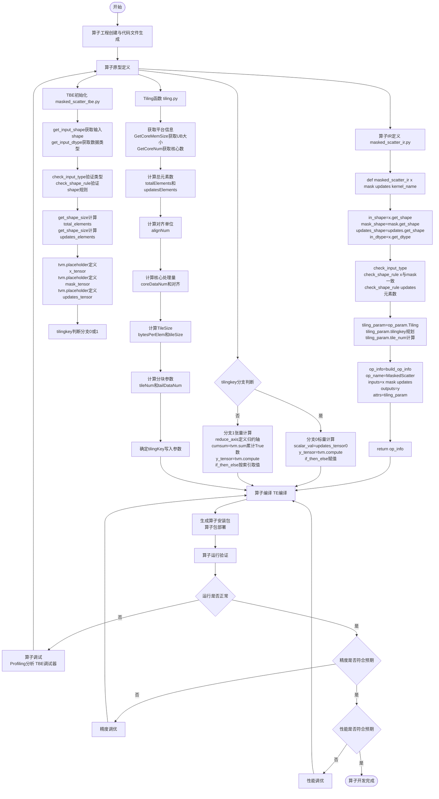

# MaskedScatter 算子设计方案

## 一、基本信息

### 1.1 需求来源

MaskedScatter 算子是深度学习框架中高频使用的数据操作算子，核心语义为：根据布尔掩码张量 mask，将 updates 张量的元素按顺序散布到输入张量 x 中 mask 为 True 的位置，最终返回更新后的张量。该算子广泛应用于条件赋值、数据筛选、掩码更新等深度学习场景。

本方案基于昇腾算子开源仓开发要求，参考昇腾版本内置 MaskedScatter 算子的 TBE 实现，基于 Ascend C 编程语言完成功能一致的算子开发，适配 Atlas A2 训练系列硬件平台。

### 1.2 背景介绍

基于 MaskedScatter 算子历史 TBE 版本，使用 Ascend C 编程语言进行优化实现，保证算子功能、精度与原 TBE 版本完全对齐，性能满足验收要求，最终合入昇腾算子开源仓。

#### [1.2.2.1](1.2.2.1) TBE 版本支持能力

MaskedScatter 算子 TBE 版本支持的能力如下：

- **支持的数据类型**：x/updates/y：float、float16、int8、uint8、int16、int32、bfloat16；mask：bool

- **支持的数据格式**：ND（任意维度格式）

- **支持的张量维度**：1-8 维

#### [1.2.2.2](1.2.2.2) TBE 实现分析

**TBE 实现使用的 API**：

|API 名称|功能说明|使用场景|
|---|---|---|
|`tvm.compute`|定义计算逻辑|定义 mask 判断和元素赋值的核心计算|
|`tvm.if_then_else`|条件判断|判断 mask 是否为 True，决定使用 updates 还是 x|
|`tvm.reduce_axis`|定义归约轴|计算 mask 中 True 的累计数量，用于 updates 索引|
|`tvm.sum`|累加计算|统计 mask 中 True 的个数，确定 updates 读取位置|
|`get_shape_size`|获取 shape 大小|计算输入张量的元素总数|
|`check_input_type`|输入类型检查|验证输入数据类型是否符合要求|
|`check_shape_rule`|shape 规则检查|验证 x 与 mask shape 是否一致|
**核心计算逻辑**：

```Python

for i in range(total_elements):
    y[i] = tvm.if_then_else(
        mask[i] == True,
        updates[cumsum(mask, i)],
        x[i]
    )
```

#### [1.2.2.3](1.2.2.3) TBE 实现流程图


---

## 二、需求分析

### 2.1 外部组件依赖

不涉及外部组件依赖。

### 2.2 内部适配模块

适配 Aclnn 接口和图模式调用，与原 TBE 算子接口完全对齐。

---

## 三、需求模块设计

### 3.1 使能方式

|框架|是否支持|
|---|---|
|TF训练/推理|-|
|PyTorch训练/推理|-|
|ATC推理|-|
|**Aclnn直调**|**√**|
|OPAT调优|-|
|SGAT子图切分|-|
### 3.2 算子原型定义

#### 算子原型

|名称|类别|dtype|format|shape|介绍|
|---|---|---|---|---|---|
|x|输入|float16/float/int32/int8/uint8/int16/bfloat16|ND|all|待更新的输入张量|
|mask|输入|bool|ND|与x完全一致|布尔掩码张量，用于标记需要更新的位置|
|updates|输入|float16/float/int32/int8/uint8/int16/bfloat16|ND|元素总数等于mask中True的个数|用于散布更新的张量|
|y|输出|float16/float/int32/int8/uint8/int16/bfloat16|ND|同输入x|输出张量，更新后的结果张量|
**文件路径**：`op_host/masked_scatter_def.cpp`

```C++

/**
 * MaskedScatter 算子原型定义
 *
 * 参数：
 *   x       - 待更新的输入张量
 *   mask    - 布尔掩码张量，shape 与 x 完全一致
 *   updates - 用于散布更新的张量，元素总数 = mask 中 True 的个数
 *   y       - 输出张量，shape/dtype 与 x 完全一致
 *
 * 支持数据类型：float / float16 / int8 / uint8 / int16 / int32 / bfloat16
 * 支持格式：ND
 * 支持维度：1-8 维
 */

#include "register/op_def_registry.h"

namespace ops {

class MaskedScatter : public OpDef {
public:
    explicit MaskedScatter(const char* name) : OpDef(name)
    {
        // x: 待更新的输入张量，支持 7 种数据类型
        this->Input("x")
            .ParamType(REQUIRED)
            .DataType({ge::DT_FLOAT, ge::DT_FLOAT16, ge::DT_INT8, ge::DT_UINT8,
                       ge::DT_INT16, ge::DT_INT32, ge::DT_BF16})
            .Format({ge::FORMAT_ND, ge::FORMAT_ND, ge::FORMAT_ND, ge::FORMAT_ND,
                     ge::FORMAT_ND, ge::FORMAT_ND, ge::FORMAT_ND})
            .UnknownShapeFormat({ge::FORMAT_ND, ge::FORMAT_ND, ge::FORMAT_ND, ge::FORMAT_ND,
                                 ge::FORMAT_ND, ge::FORMAT_ND, ge::FORMAT_ND});

        // mask: 布尔掩码，shape 与 x 完全一致
        this->Input("mask")
            .ParamType(REQUIRED)
            .DataType({ge::DT_BOOL, ge::DT_BOOL, ge::DT_BOOL, ge::DT_BOOL,
                       ge::DT_BOOL, ge::DT_BOOL, ge::DT_BOOL})
            .Format({ge::FORMAT_ND, ge::FORMAT_ND, ge::FORMAT_ND, ge::FORMAT_ND,
                     ge::FORMAT_ND, ge::FORMAT_ND, ge::FORMAT_ND})
            .UnknownShapeFormat({ge::FORMAT_ND, ge::FORMAT_ND, ge::FORMAT_ND, ge::FORMAT_ND,
                                 ge::FORMAT_ND, ge::FORMAT_ND, ge::FORMAT_ND});

        // updates: 散布更新张量，dtype 与 x 一致
        this->Input("updates")
            .ParamType(REQUIRED)
            .DataType({ge::DT_FLOAT, ge::DT_FLOAT16, ge::DT_INT8, ge::DT_UINT8,
                       ge::DT_INT16, ge::DT_INT32, ge::DT_BF16})
            .Format({ge::FORMAT_ND, ge::FORMAT_ND, ge::FORMAT_ND, ge::FORMAT_ND,
                     ge::FORMAT_ND, ge::FORMAT_ND, ge::FORMAT_ND})
            .UnknownShapeFormat({ge::FORMAT_ND, ge::FORMAT_ND, ge::FORMAT_ND, ge::FORMAT_ND,
                                 ge::FORMAT_ND, ge::FORMAT_ND, ge::FORMAT_ND});

        // y: 输出张量，shape/dtype 与 x 完全一致
        this->Output("y")
            .ParamType(REQUIRED)
            .DataType({ge::DT_FLOAT, ge::DT_FLOAT16, ge::DT_INT8, ge::DT_UINT8,
                       ge::DT_INT16, ge::DT_INT32, ge::DT_BF16})
            .Format({ge::FORMAT_ND, ge::FORMAT_ND, ge::FORMAT_ND, ge::FORMAT_ND,
                     ge::FORMAT_ND, ge::FORMAT_ND, ge::FORMAT_ND})
            .UnknownShapeFormat({ge::FORMAT_ND, ge::FORMAT_ND, ge::FORMAT_ND, ge::FORMAT_ND,
                                 ge::FORMAT_ND, ge::FORMAT_ND, ge::FORMAT_ND});

        // AICore 配置
        OpAICoreConfig aicoreConfig;
        aicoreConfig.DynamicCompileStaticFlag(true)
            .DynamicFormatFlag(false)
            .DynamicRankSupportFlag(true)
            .DynamicShapeSupportFlag(true)
            .NeedCheckSupportFlag(false)
            .PrecisionReduceFlag(true)
            .ExtendCfgInfo("opFile.value", "masked_scatter");
        this->AICore().AddConfig("ascend910b", aicoreConfig);
    }
};

OP_ADD(MaskedScatter);

} // namespace ops
```

### 3.3 详细设计

#### 3.3.1 host 侧设计

##### [3.3.1.1](3.3.1.1) 分核策略

**多核任务均分策略**：将 x/mask 的总元素数均分到各核心，每个核心处理相等的数据量。

|参数|计算公式|说明|
|---|---|---|
|usedCoreNum|min(coreNum, totalElements)|确定使用核心数|
|coreDataNum|ceil(totalElements / usedCoreNum)|单核心处理数据量，对齐到 alignNum|
|tileNum|ceil(coreDataNum / tileSize)|每个核心内的 Tile 分块数|
|tailDataNum|coreDataNum mod tileSize|尾块数据量|
##### [3.3.1.2](3.3.1.2) 数据分块内存优化策略

**UB 内存分配**：

```C++

// UB 内存预留（保留 2048 字节给系统）
constexpr uint64_t RESERVED_UB = 2048;
constexpr uint32_t BUFFER_NUM = 2;

// 每个元素占用：x(typeLength) + mask(1 byte) + y(typeLength)，乘以 BUFFER_NUM
uint64_t bytesPerElem = (typeLength * 2 + 1) * BUFFER_NUM;

// 计算可用的 UB 空间
uint64_t availUb = (ubSize > RESERVED_UB) ? (ubSize - RESERVED_UB) : (ubSize / 2);

// 计算每个 Tile 的最大数据量
uint64_t maxTileElems = availUb / bytesPerElem;

// 对齐到 alignNum
if (alignNum > 1) {
    maxTileElems = (maxTileElems / alignNum) * alignNum;
}
uint32_t tileSize = static_cast<uint32_t>(maxTileElems);
```

**内存计算公式**：

- x buffer 大小：`tileSize * sizeof(T)`（32 字节对齐）

- mask buffer 大小：`tileSize * sizeof(uint8_t)`（32 字节对齐）

- y buffer 大小：`tileSize * sizeof(T)`（32 字节对齐）

##### [3.3.1.3](3.3.1.3) tilingKey 规划策略

|tilingKey|条件|处理方式|
|---|---|---|
|**SCALAR (0)**|updates 元素数 == 1|所有 mask==True 位置填同一个标量值|
|**TENSOR (1)**|updates 元素数 > 1|按 mask 中 True 的顺序依次从 updates 取值|
**Host 侧核心逻辑**：

```C++

// 确定 tilingkey
uint32_t tilingKey = (updatesElements == 1) ? TILING_KEY_SCALAR : TILING_KEY_TENSOR;

// 写入 Tiling 参数
tiling->totalElements = totalElements;
tiling->updatesElements = updatesElements;
tiling->coreDataNum = coreDataNum;
tiling->tileNum = tileNum;
tiling->tileSize = tileSize;
tiling->tailDataNum = tailDataNum;
tiling->coreNum = usedCoreNum;
tiling->tilingKey = tilingKey;

// 设置核数与 TilingKey
context->SetBlockDim(usedCoreNum);
context->SetTilingKey(tilingKey);
```

#### 3.3.2 kernel 侧设计

##### [3.3.2.1](3.3.2.1) kernel 实现类（与 TBE 源码完全一致）

**Ascend C 实现使用的 API**（与源码一致）：

|API 类别|API 名称|功能说明|使用场景|
|---|---|---|---|
|**内存管理**|`AllocTensor`|分配 UB 片上内存|CopyIn/Compute 阶段分配输入/输出缓冲区|
||`FreeTensor`|释放 UB 内存|Compute/CopyOut 阶段释放已使用的缓冲区|
|**数据搬运**|`DataCopyPad`|带填充的数据搬运|CopyIn 阶段 GM到UB，CopyOut 阶段 UB到GM，保证 32 字节对齐|
|**流水队列**|`EnQue`|数据入队|CopyIn 后将数据压入输入队列，Compute 后将结果压入输出队列|
||`DeQue`|数据出队|Compute 前从输入队列取数据，CopyOut 前从输出队列取结果|
|**队列初始化**|`pipe.InitBuffer`|初始化流水队列|Init 阶段配置输入/输出队列的 Buffer 数量和大小|
|**张量操作**|`GetValue`|获取张量元素值|Compute 阶段读取 x、mask、updates 的元素|
||`SetValue`|设置张量元素值|Compute 阶段写入 y 的元素|
||`SetGlobalBuffer`|设置全局内存缓冲区|Init 阶段绑定 GM 地址到 GlobalTensor|
|**并行控制**|`GetBlockIdx`|获取当前核心编号|Init 阶段获取多核并行参数|
##### [3.3.2.2](3.3.2.2) AscendC 实现流程图（与源码完全一致）

```mermaid
flowchart TB
    A([开始]) --> B[算子工程创建与代码文件生成]
    B --> C[算子原型定义 MaskedScatter]
    C --> D[算子IR定义 masked_scatter_def.cpp\nREG_OP MaskedScatter\n.INPUT x .INPUT mask .INPUT updates\n.OUTPUT y .OP_END_FACTORY_REG]
    D --> D1[InferShapeForMaskedScatter\n获取输入x的Shape]
    D1 --> D2{xShape是否为空}
    D2 -->|是| D3[返回GRAPH_FAILED]
    D2 -->|否| D4[获取输出y的Shape指针]
    D4 --> D5{yShape是否为空}
    D5 -->|是| D3
    D5 -->|否| D6[设置y的Shape与x一致]
    D6 --> D7[返回GRAPH_SUCCESS]
    C --> E[Host侧Tiling masked_scatter_tiling.cpp]
    E --> E1[MaskedScatterTilingFunc\nmemset_s初始化Tiling结构体]
    E1 --> E2[获取平台信息\nGetCoreMemSize获取UB大小\nGetCoreNum获取核心数]
    E2 --> E3[读取输入Shape\nxShape和updatesShape]
    E3 --> E4[计算总元素数\ntotalElements和updatesElements]
    E4 --> E5{总元素数是否为0}
    E5 -->|是| E6[返回GRAPH_FAILED]
    E5 -->|否| E7[获取数据类型长度]
    E7 --> E8[计算对齐单位\nalignNum = 32/typeLength]
    E8 --> E9[确定使用核心数\nusedCoreNum = min coreNum totalElements]
    E9 --> E10[计算单核心处理量\ncoreDataNum = ceil totalElements/usedCoreNum\n对齐到alignNum]
    E10 --> E11[计算TileSize\ntileSize = availUb/bytesPerElem\n对齐到alignNum]
    E11 --> E12[计算分块参数\ntileNum = ceil coreDataNum/tileSize\ntailDataNum = coreDataNum mod tileSize]
    E12 --> E13{确定tilingKey\nupdatesElements等于1}
    E13 -->|是| E14[tilingKey = SCALAR]
    E13 -->|否| E15[tilingKey = TENSOR]
    E14 --> E16[写入Tiling参数\nSetBlockDim SetTilingKey]
    E15 --> E16
    C --> F[Ascend C Kernel实现 masked_scatter.h]
    F --> F1[MaskedScatter Init\n读取Tiling分块参数]
    F1 --> F2[获取多核并行参数\ncoreId = GetBlockIdx\nASSERT GetBlockNum非0]
    F2 --> F3[绑定全局内存张量\nSetGlobalBuffer xGm maskGm updatesGm yGm]
    F3 --> F4[计算UB分配大小\nxAllocSize = tileSize*sizeof T/ALIGN_BYTES\nmaskAllocSize = tileSize*1/ALIGN_BYTES]
    F4 --> F5[初始化流水队列\npipe.InitBuffer xInQue maskInQue yOutQue]
    F5 --> G1[Process核心循环开始\n计算多核偏移coreOffset]
    G1 --> G2{Tile循环 i < tileNum}
    G2 -->|是| G3[设置当前Tile处理量\n最后一轮用tailDataNum\n否则用tileSize]
    G3 --> G4[计算Tile全局偏移\ntileOffset = coreOffset + i*tileSize]
    G4 --> G5{Tile偏移是否越界\ntileOffset >= totalElements}
    G5 -->|是| G6[跳出Tile循环]
    G5 -->|否| G7[边界修正处理量\nprocessDataNum = totalElements-tileOffset]
    G7 --> H1[CopyIn阶段开始\nAllocTensor分配x本地缓冲区\nAllocTensor分配mask本地缓冲区]
    H1 --> H2[配置数据搬运参数\nDataCopyExtParams DataCopyPadExtParams]
    H2 --> H3[GM到UB数据搬运\nDataCopyPad xLocal xGm offset\nDataCopyPad maskLocal maskGm offset]
    H3 --> H4[数据压入流水队列\nxInQue.EnQue xLocal\nmaskInQue.EnQue maskLocal]
    H4 --> I1{tilingKey分支判断\n等于TILING_KEY_SCALAR}
    I1 -->|是| I2[ComputeScalar标量分支\nDeQue取x和mask数据\nAllocTensor分配y输出缓冲区]
    I1 -->|否| I3[ComputeTensor张量分支\nDeQue取x和mask数据\nAllocTensor分配y输出缓冲区]
    I2 --> I4[读取标量值\nscalarVal = updatesGm.GetValue 0]
    I3 --> I5[计算全局偏移基准\ngmOffset = coreId*coreDataNum+offset]
    I4 --> I6[for i < processDataNum\nif maskLocal i != 0\nyLocal i = scalarVal\nelse yLocal i = xLocal i]
    I5 --> I7[for i < processDataNum\nif maskLocal i != 0\nupdIdx = gmOffset+i\nyLocal i = updatesGm.GetValue updIdx\nelse yLocal i = xLocal i]
    I6 --> I8[FreeTensor释放输入内存\nxInQue.FreeTensor\nmaskInQue.FreeTensor]
    I7 --> I8
    I8 --> I9[结果压入输出队列\nyOutQue.EnQue yLocal]
    I9 --> J1[CopyOut阶段开始\nDeQue取计算结果]
    J1 --> J2[配置数据搬运参数\nDataCopyExtParams设置有效长度]
    J2 --> J3[UB到GM数据搬运\nDataCopyPad yGm offset yLocal]
    J3 --> J4[释放输出UB内存\nyOutQue.FreeTensor yLocal]
    J4 --> G2
    G2 -->|否| K1([Process阶段结束])
    G6 --> K1
    E16 --> L[算子编译 Ascend C编译]
    I2 --> L
    I3 --> L
    D7 --> L
    J4 --> L
    L --> M[生成算子安装包]
    M --> N[算子部署]
    N --> O[算子运行验证]
    O --> P{运行是否正常}
    P -->|否| Q[算子调试 Profiling分析 调试器]
    Q --> C
    P -->|是| R{精度是否符合预期}
    R -->|否| S[精度调优]
    S --> L
    R -->|是| T{性能是否符合预期}
    T -->|否| U[性能调优]
    U --> L
    T -->|是| V([算子开发完成])
```


##### [3.3.2.3](3.3.2.3) AscendC 实现与 TBE 实现存在的差异

|差异项|TBE 实现|Ascend C 实现|
|---|---|---|
|**编程语言**|Python (TVM)|C++ (Ascend C)|
|**执行方式**|图编译后执行|核函数直接执行|
|**数据搬运**|tvm.compute 自动调度|DataCopyPad 手动显式搬运|
|**tilingkey 判断**|Python 层面判断|C++ 层面判断 (if-else)|
|**内存管理**|TVM 自动管理|手动 AllocTensor/FreeTensor|
|**多核并行**|TVM 调度器自动分配|GetBlockIdx 获取核心编号|
|**流水队列**|TVM 自动调度|TQue + EnQue/DeQue 显式管理|
|**数据精度**|float16/float32/int8 等|float16/float32/int8/uint8/int16/int32/bfloat16|
|**mask 类型**|bool|uint8_t (Ascend C 不支持 bool)|
**核心差异说明**：

1. **编程语言差异**：TBE 使用 Python + TVM DSL，Ascend C 使用 C++ 原生编程

2. **内存管理**：TBE 由 TVM 自动管理 UB 内存，Ascend C 需要手动 AllocTensor/FreeTensor

3. **数据搬运**：TBE 通过 tvm.compute 自动调度，Ascend C 需要显式调用 DataCopyPad

4. **流水并行**：TBE 由 TVM 调度器实现，Ascend C 需要手动管理 TQue 队列

5. **mask 类型**：Ascend C 使用 uint8_t 替代 bool，避免 SIMD 指令兼容问题

### 3.3 支持硬件

|芯片版本|是否支持|
|---|---|
|Atlas A2 训练系列产品|**√**|
### 3.4 算子约束

- **不支持广播**：所有输入张量不进行自动广播处理，输入 shape 不一致直接报错

- **Shape 一致性**：x 与 mask 的 shape 必须完全一致

- **元素数量匹配**：updates 的元素总数必须等于 mask 中 True 的元素个数

- **输出一致性**：输出 y 与 x 的 shape、dtype 完全一致

- **泛化支持**：支持所有合法输入场景，适配泛化数据验收要求

---

## 四、验收标准

|验收标准|描述|
|---|---|
|精度标准|严格符合 AscendOpTest 工具默认阈值：float32 最大绝对误差不超过1e-5，float16 最大绝对误差不超过1e-3，整数类型精确计算|
|性能标准|所有核参与计算场景下，性能不低于原 TBE 算子的 95%；针对 10us 以下的小 shape 场景，若存在 3us 以内的差值，将提供性能仿真图和分析结论|
---

## 五、可维可测

### 5.1 精度标准/性能标准

|验收标准|描述|
|---|---|
|精度标准|严格符合 AscendOpTest 工具默认阈值：float32 最大绝对误差不超过1e-5，float16 最大绝对误差不超过1e-3，整数类型精确计算|
|性能标准|1. 所有核参与计算场景下，性能不低于原 TBE 算子的 95%；2. 针对 10us 以下的小 shape 场景，若存在 3us 以内的差值，将提供性能仿真图和分析结论|
### 5.2 兼容性分析

新算子实现，与原 TBE 算子接口、功能完全对齐，不涉及兼容性问题。

---

## 六、版本信息

|项目|版本|
|---|---|
|算子版本|v1.0|
|CANN 版本|算子开源仓指定版本|
|目标硬件|Atlas A2 训练系列产品|
|开发语言|Ascend C|
---

## 七、代码仓库

**上游开源仓地址**：[https://gitcode.com/cann/ops-nn](https://gitcode.com/cann/ops-nn)

**个人开发仓地址（fork 自上游开源仓）**：[https://gitcode.com/gcw_3bzf0JPe/ops-nn/tree/feature/masked_scatter_readme](https://gitcode.com/gcw_3bzf0JPe/ops-nn/tree/feature/masked_scatter_readme)